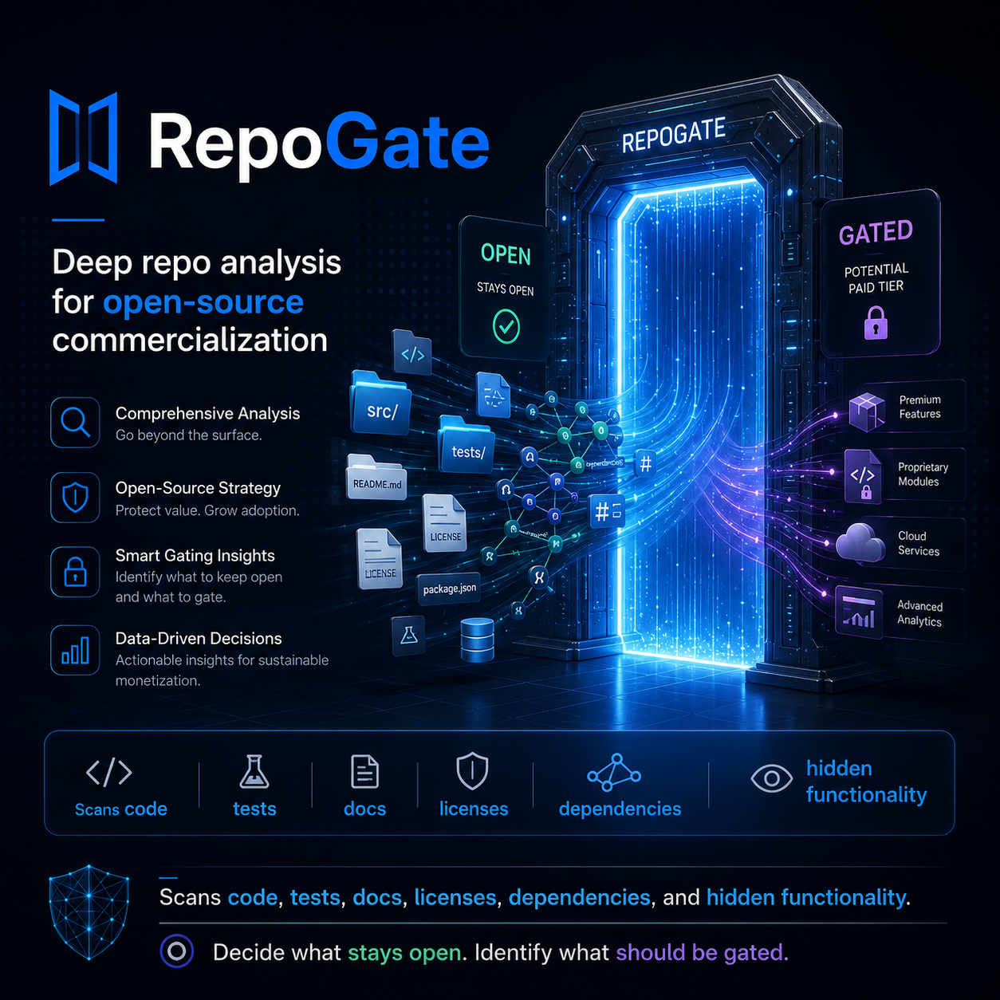

<div align="center">




### 🛡️ Decide what stays **open**, what becomes **commercial**, and what needs **legal review** — with confidence.

<p>

[](https://www.rust-lang.org/)
[](https://claude.ai/code)
[](https://nextjs.org/)
[](LICENSE)

</p>

<p>


</p>

[**🚀 Quick Start**](#-quick-start) · [**🏗️ Architecture**](#️-how-it-works) · [**📊 Output**](#-output) · [**📚 Docs**](#-documentation) · [**💰 Cost**](#-cost)

</div>

---

## 📋 Overview

> **RepoGate** is a deep repository assessment platform that analyzes complete open-source codebases to determine **what functionality should remain open source**, **what should be commercialized into paid tiers**, and **what requires legal or licensing review** before packaging.

Rather than surface-level README scanning, RepoGate traverses the **full codebase** — inspecting source files, tests, examples, configuration, deployment assets, and documentation — to identify *all* functionality before recommending what stays open and what becomes part of a commercial tier.

```bash
repogate analyze <repo-url>   →   📄 JSON + Markdown reports across 7 gating tiers
```

<table>
<tr>
<td width="33%" valign="top">

### 🔍 Deep, not shallow
Spawns a **Claude Code sub-agent per module** to uncover hidden, undocumented, and enterprise-grade capabilities.

</td>
<td width="33%" valign="top">

### ⚖️ Legally aware
First-class **license detection, SPDX compliance, and supply-chain scanning** flag risk before you gate anything.

</td>
<td width="33%" valign="top">

### 🎯 Strategy-driven
Quantitative **commercial-value scoring** with built-in guardrails against over-gating and community backlash.

</td>
</tr>
</table>

---

## ✨ Key Features

| | Feature | Description |
|:--:|---------|-------------|
| 🧬 | **Full-codebase traversal** | `.gitignore`-aware walking of source, tests, examples, config, and deploy assets |
| 🤖 | **Agent-in-the-loop analysis** | Claude Code as the in-session reasoning engine — one sub-agent per functional module |
| ⚖️ | **License & supply-chain scan** | SPDX expression parsing, license classification, and dependency scanning via `syft` |
| 📊 | **Commercial-value scoring** | Adoption impact, enterprise buyer value, competitive sensitivity, support burden |
| 🚧 | **7-tier gating engine** | From `open` to `managed_cloud`, with explicit `legal_review` and `not_recommended` safeguards |
| 📄 | **Dual-format reports** | Machine-readable JSON **and** an executive-ready Markdown narrative |
| 🌐 | **Web dashboard** | Next.js UI for viewing and sharing assessment reports |

---

## 🏗️ How It Works


| Step | Stage | What happens |
|:--:|-------|--------------|
| 1️⃣ | **Ingest** | Clone and analyze repository structure, dependency manifests, and license files |
| 2️⃣ | **License Scan** | Identify licenses, detect conflicts, and flag files needing legal review (`spdx`, `syft`) |
| 3️⃣ | **Module Discovery** | Break the repository into functional modules (core runtime, APIs, SDKs, CLIs, connectors, dashboards…) |
| 4️⃣ | **Deep Analysis** | Spawn a Claude Code sub-agent **per module** to uncover hidden capabilities and enterprise value |
| 5️⃣ | **Scoring** | Evaluate each module against commercial-value criteria |
| 6️⃣ | **Gating Strategy** | Recommend boundaries between open-source core and commercial tiers, with risk analysis |
| 7️⃣ | **Report** | Output structured JSON + a human-readable Markdown report |

---

## 🧰 Tech Stack

### 🦀 Rust (Primary)

| Crate / Tool | Role |
|--------------|------|
| `git → gix` | Repository cloning (subprocess `git clone --depth=1 --filter=blob:none` for MVP → pure-Rust `gix`) |
| `ignore` / `walkdir` | `.gitignore`-aware directory traversal |
| `spdx` | SPDX license expression parsing & compliance checking |
| `sqlx` | Async SQL (SQLite / Postgres) for assessment storage & versioning |
| `axum` + `tower-http` | High-performance async web server for the API |
| `clap` | Command-line argument parsing (CLI) |
| `minijinja` | Template rendering for report generation |
| `schemars` + `serde` | JSON schema generation & (de)serialization |

### 🔌 External

| Tool | Role |
|------|------|
| 🧪 `syft` | Supply-chain dependency scanning (subprocess) |
| 🤖 **Claude Code CLI** (`claude --bare -p`) | Headless codebase analysis via `stream-json` output & `--json-schema` |

### 🎨 Frontend

| Tool | Role |
|------|------|
| ▲ **Next.js** | React dashboard for viewing and sharing assessment reports |

### 📦 Workspace Crates

```text
crates/
├── 🧠 repogate-core          # Domain model & shared types
├── 📥 repogate-ingestion     # Cloning & codebase traversal
├── ⚖️  repogate-licensing     # License detection & SPDX compliance
├── 🤖 repogate-orchestrator  # Claude Code agent orchestration
├── 📊 repogate-scoring       # Commercial-value & gating scoring
├── 📄 repogate-report        # JSON + Markdown report generation
├── ⌨️  repogate-cli           # `repogate` command-line interface
└── 🌐 repogate-server        # Axum API server
```

---

## 📦 Installation

### ✅ Prerequisites

| Requirement | Notes |
|-------------|-------|
| 🦀 **Rust toolchain** (1.70+) | [Install Rust](https://rustup.rs/) |
| 🤖 **Claude CLI** (authenticated) | [Install Claude Code](https://claude.ai/docs/claude-code) |
| 🧪 **syft** binary | [Anchore syft releases](https://github.com/anchore/syft/releases) or your package manager |

### 🔨 Build

```bash
git clone https://github.com/yourusername/repo-gate.git
cd repo-gate
cargo build --release
```

> 💡 The compiled binary is available at `target/release/repogate`.

---

## 🚀 Quick Start

```bash
# 🔍 Analyze a public open-source repository
repogate analyze https://github.com/rust-lang/rust

# 📄 Output includes:
#   • assessment.json  → structured gating recommendation
#   • assessment.md    → human-readable report
```

---

## 📊 Output

### 🚧 Gating Tiers

RepoGate recommends **one of seven tiers** for each module:

| # | Tier | Meaning |
|:--:|------|---------|
| 🟢 1 | **`open`** | Remains in the open-source community edition; foundational to adoption |
| 🔵 2 | **`source_available`** | Source published but binaries/services restricted; prevents direct commercial forks |
| 🟣 3 | **`pro_tier`** | Professional/team features; supports individuals and small organizations |
| 🟠 4 | **`enterprise_tier`** | Enterprise features; multi-tenant, SSO, advanced compliance, SLA support |
| ☁️ 5 | **`managed_cloud`** | Proprietary managed service; deployment, scaling, monitoring, operational burden |
| ⚠️ 6 | **`legal_review`** | Licensing/legal concerns prevent a clear recommendation; requires manual review |
| 🛑 7 | **`not_recommended`** | Over-gating risk; community backlash likely if closed — recommend keeping open |

### 📑 Report Sections

- 📌 **Executive Summary** — High-level assessment, recommended open-core boundary, and strategic positioning
- 🗂️ **Functionality Inventory** — Observed features, including hidden, undocumented, and enterprise capabilities
- 🧭 **Repository Architecture** — Module breakdown with data flow and dependency graph
- 🔬 **Module Analysis** — Per-module scoring (commercial value, adoption value, risk, gating suitability)
- ⚖️ **Licensing Posture** — License compliance, mixed-license risks, third-party concerns
- 💵 **Commercial Value Scoring** — Quantitative business-impact assessment for each tier
- 🚨 **Risk Analysis** — Over-gating, community adoption, competitive exposure, security
- 🎯 **Final Recommendations** — Clear tier boundaries and product packaging strategy

---

## 👥 For Whom

<table>
<tr>
<td>🛠️ <b>Open-source maintainers</b><br/>deciding on commercialization strategy</td>
<td>🏢 <b>Infrastructure & platform teams</b><br/>evaluating repository value</td>
</tr>
<tr>
<td>🚀 <b>Founders & CTOs</b><br/>commercializing open-source software</td>
<td>📦 <b>Product leaders</b><br/>defining open-core strategy & tier boundaries</td>
</tr>
<tr>
<td>🌐 <b>Enterprise software teams</b><br/>managing complex open-source ecosystems</td>
<td>⚖️ <b>Legal & licensing reviewers</b><br/>assessing compliance risk before gating</td>
</tr>
</table>

---

## 📚 Documentation

| 📖 Guide | Description |
|----------|-------------|
| 🧭 **[Architecture Overview](docs/architecture.md)** | System design, pipeline, and Claude Code integration |
| 🚦 **[Getting Started](docs/getting-started.md)** | Prerequisites, build, run, and interpretation guide |
| 🗒️ **[Architecture Decision Records](docs/adr/)** | Design rationale and trade-offs (ADR index) |
| 🧩 **[Domain Model](docs/ddd/)** | Bounded contexts and domain entity reference |

---

## 💰 Cost

RepoGate uses Claude Code (programmatic `claude` CLI) for deep repository analysis. Cost scales with repository size and complexity:

| 📦 Repository size | 💵 Estimated cost |
|--------------------|-------------------|
| 🟢 Small (< 10k lines) | ~$0.10 – $0.50 |
| 🟡 Medium (10k – 100k lines) | ~$1 – $5 |
| 🔴 Large (100k+ lines) | ~$5 – $20+ |

> 📈 Pricing follows Claude's standard token rates (January 2026). See [Anthropic Pricing](https://anthropic.com/pricing) for current rates.

---

## 🤝 Contributing

Contributions are welcome! 🎉 Please read **[CLAUDE.md](CLAUDE.md)** for development guidelines and agent coordination patterns.

## 📄 License

RepoGate is open source under the **MIT License**. See [LICENSE](LICENSE) for details.

---

<div align="center">

**❓ Questions?** Check the [Getting Started](docs/getting-started.md) guide or [file an issue](https://github.com/yourusername/repo-gate/issues).

<sub>Built with 🦀 Rust · 🤖 Claude Code · ▲ Next.js</sub>


</div>
